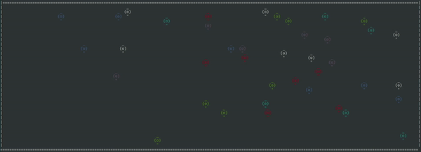

## Hi, I'm Jonas :wave:

I'm a German/Jordanian software engineer with a background in theoretical physics from Imperial College London. Currently interested in Rust, meta learning and quantum field theory.

---

### :wrench: Tech & Tools

-x?style=flat&logo=javascript&logoColor=white&color=yellowgreen)

-x?style=flat&logo=tensorflow&logoColor=white&color=2bbc8a)

---

### :computer: Projects

#### :bus: London Travel Time Heatmap
This heatmap tells you how long it takes to get to anywhere in London via public transport from one or more starting locations. Ideal for figuring out where to meet with your friends, or how well your potential new home is connected. The backend is written in rust and the frontend in react. Check it out [here!](https://tflmap.onrender.com/).

#### :collision: Particles in a box and ascii animation

 Check out my ascii-animated, optimized C++ particle simulation [here](https://github.com/jonas-scholz123/particle-simulation).

---

 

#### :eyes: :arrow_right: :ear: Hearing Images
Another project that I'm proud of is my *hearing images* application, in which live video data is converted to audio signals, which could function as a translater of visual information for visually impaired people. For a very quick intro, see the gif above. You can check it out (and try it out) [here.](https://github.com/jonas-scholz123/hearing-images)

---

#### 🧩 Cryptic Crossword Solver

Over the summer, I contributed to a compsci lecturer's project, a cryptic crossworld solver. It takes a clue from a cryptic crossword, comes up with the most likely solution and explains it to you. For example:

<pre>

The clue is: County type pair mixed, holding runs (9)
I think the solution is "TIPPERARY"

Let me explain...
I think the answer is supposed to mean "county"
I think "holding" indicates the insertion of one word into another      ◀ <strong> helped with this</strong> 
   1: The text "runs" resolves to "r"
   2: I think "mixed" indicates an anagram                              ◀ <strong> helped with this</strong> 
         I think we have the concatenation of 2 sub-clues:
            1: "type" is verbatim text
            2: "pair" is verbatim text
         Joining the results together we get "type pair"
      The required anagram is "tippeary"
For the insertion, "r" needs to be inserted into "tippeary"
The result is "tipperary"

</pre>

In particular, I worked on a classifier model based on word2vec embeddings, supposed to turn a word into all possible indicators it could represent. In the example above, this classifier evaluates "holding" as an insertion and "mixed" as an anagram indicator. Previously, indicator words were simply referenced against a list of indicators, but using the classifier, even previously unseen words can be classified.

---

### :handshake: Get in contact!

Let's make things less one-sided, message me on .
